# Project: TPC-DS Item Rental Management System

| Date | 04/28/2026 |
| :--- | :--- |
| **Group** | 183 |
| **Member** | Semyon Baykov |
| **Member** | Sherwood Dong |
| **Homework** | Project: TPC-DS Item Rental Management System |
| **Due** | Tuesday, April 28 at 11:59 PM |

## Project Description:
This project is a command line system that lets a store manage renting items to customers. It keeps track of what items are available, which customers are registered, and which items are currently rented out or have been returned. Users can add new items and customers, search for records using different filters, rent items, return them, and extend rental periods. If an item is not available, customers can join a waitlist and will be served in order when the item becomes available again. This system connects a database to store and retrieve information while also ensuring that data is kept consistent (and up-to-date) throughout all operations.

## What Works:
* The implemented solution fully supports all functional requirements outlined in the project specifications:
    * **Dynamic CRUD operations:** Adding new items and customers works correctly, including properly storing customer addresses. Editing customer information updates only the fields that are changed.
    * **Search engine:** Searching works across all tables, including filtering by names, prices, dates, and other fields.
    * **Rental lifecycle:** Renting an item correctly sets the rental and due dates and prevents renting unavailable items. Returning an item moves it to the rental history and records the return date. Granting an extension correctly adds extra time and prevents multiple extensions. The system correctly tracks how many items are in stock based on active rentals.
    * **Waitlist management:** Automatically detects out-of-stock scenarios, manages queue positions, and shifts the queue when the first person in line is satisfied. Customers are added in order and move up when items become available.
    * **Data integrity:** All database interactions utilize parameterized queries to prevent SQL injection and use surrogate keys for internal joins to maintain data normalization.

## What Does Not Work:
* All project functionality works in our solution.

## Known Bugs:
* There are no bugs as per our knowledge. We validated everything as much as possible using the public tests, and we also wrote some of our own tests for edge cases.

## Terminal Screenshots:

### 01 Setup Database
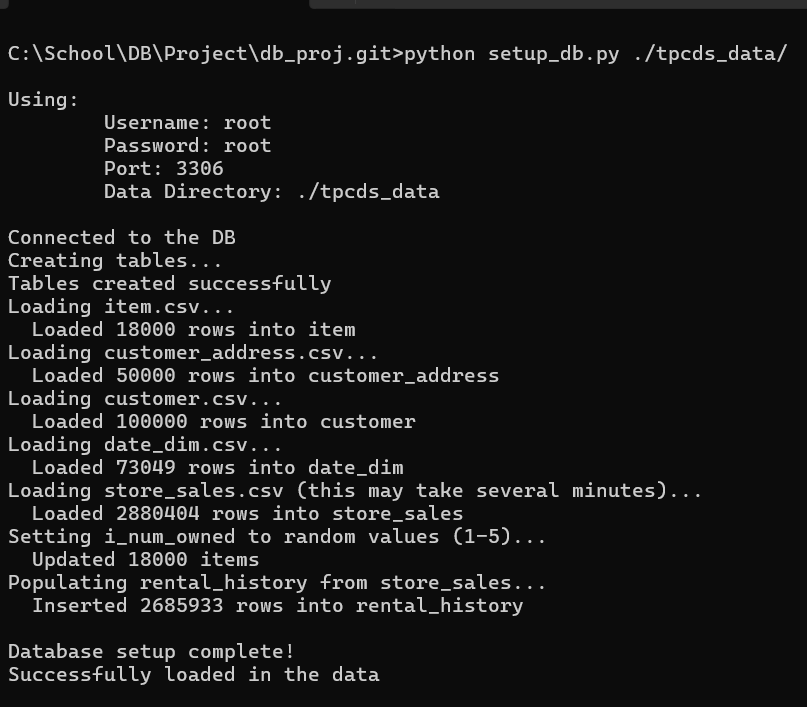

### 02 Rent an Item

### 03 Return an Item

### 04 Grant an Extension
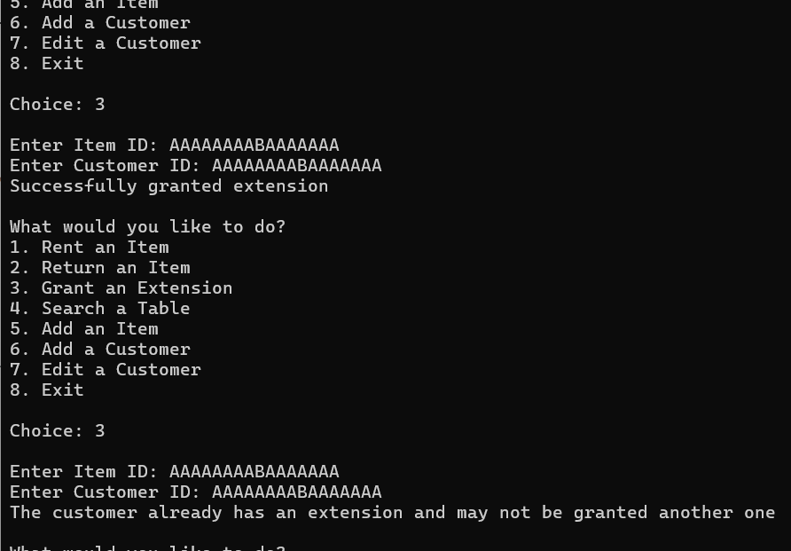

### 05 Search Item
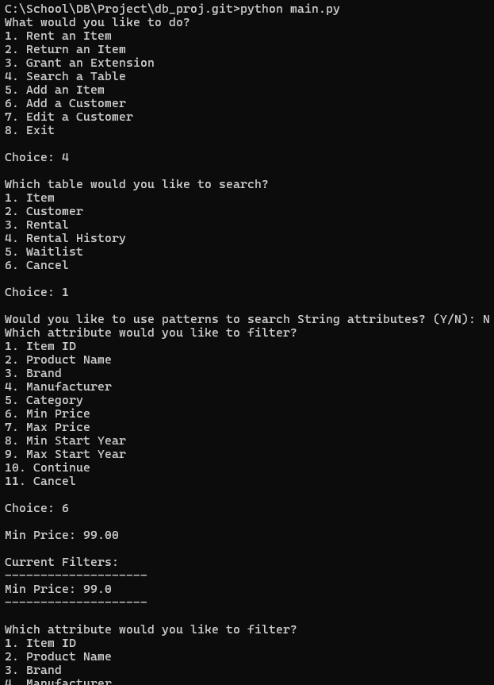
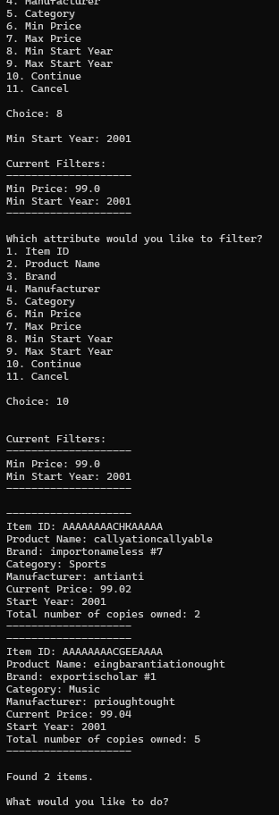

### 06 Search Customer
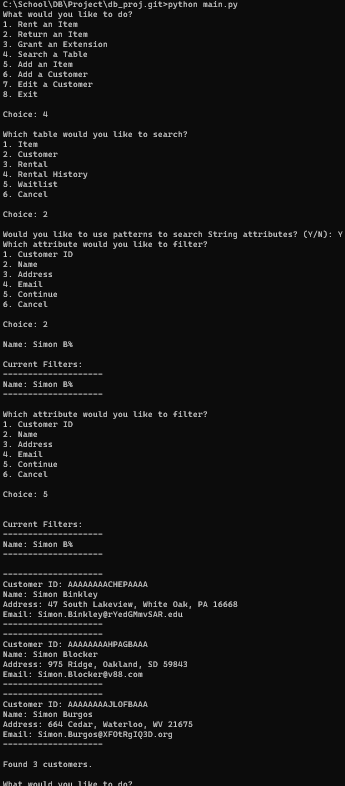

### 07 Search Rental
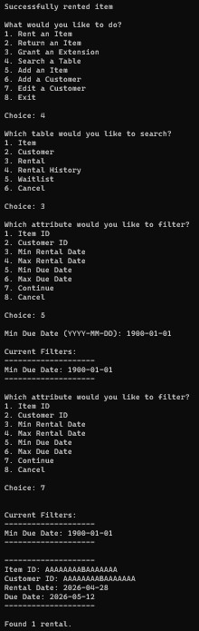

### 08 Search Rental History
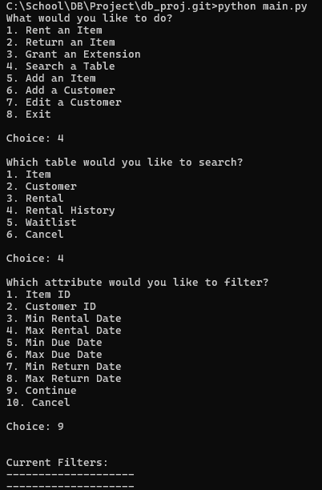
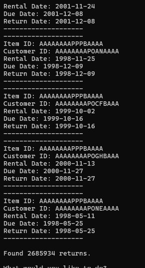

### 09 Search Waitlist
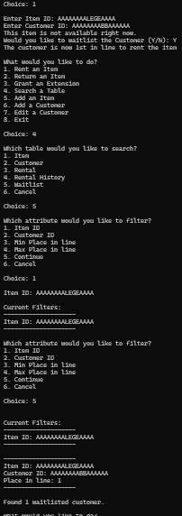

### 10 Add Item (Duplicate Rejection)
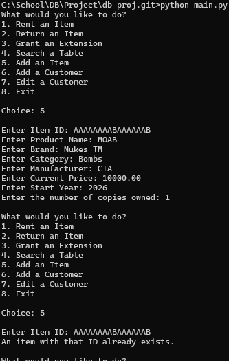

### 11 Add Customer (Duplicate Rejection)
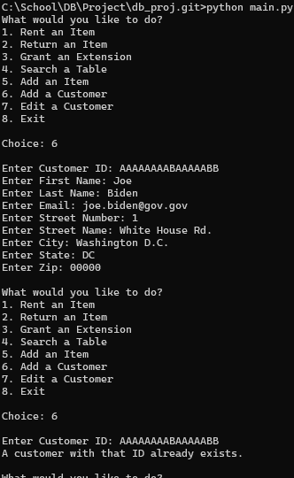

### 12 Edit Customer
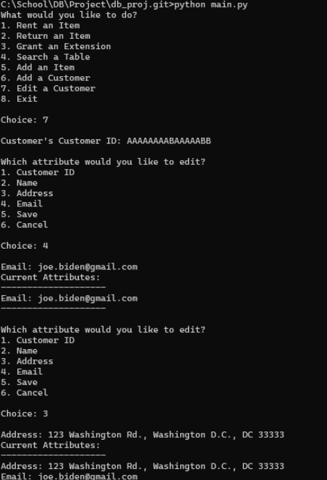
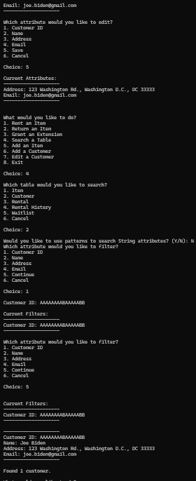
